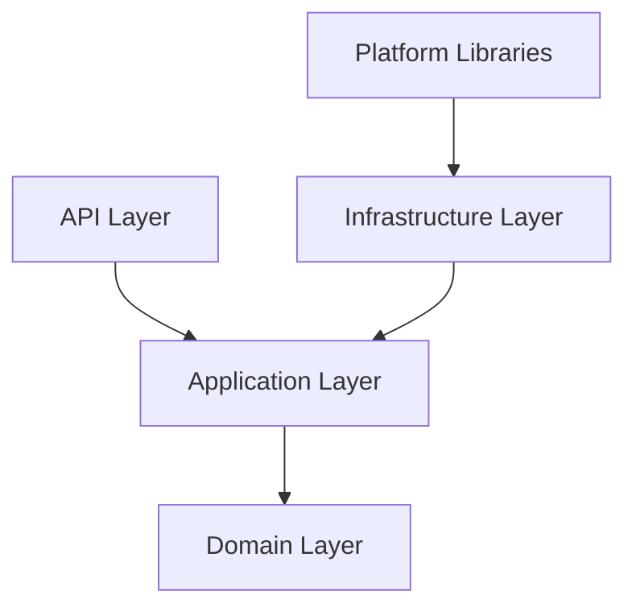

# Architecture Overview

The Platform follows a layered architecture designed to provide maximum flexibility while maintaining consistency across microservices. The architecture emphasizes separation of concerns, dependency inversion, and compile-time safety.

## Core architectural patterns

### Service Defaults pattern
The Service Defaults pattern provides a central place to configure cross-cutting concerns that should be consistent across all services:

[!code-csharp]

This pattern ensures that logging, health checks, OpenTelemetry, and other infrastructure concerns are configured consistently across your entire system.

### Extension method composition
Rather than large configuration classes, the Platform uses focused extension methods that can be composed together:

[!code-csharp]

This approach makes it easy to add or remove features without affecting other parts of the system.

## Layer responsibilities

### Infrastructure layer
The infrastructure layer contains the Platform libraries themselves:

- **Operations.ServiceDefaults** - Core service configuration
- **Operations.ServiceDefaults.Api** - API-specific extensions
- **Operations.Extensions** - Utility classes and patterns
- **Operations.Extensions.Abstractions** - Core abstractions and interfaces

### Application layer
Your application layer uses the Platform libraries to implement business logic:

- **Commands and Queries** - CQRS pattern implementations
- **Handlers** - Message and request handlers
- **API Controllers** - HTTP endpoints and gRPC services

### Domain layer
The domain layer remains independent of the Platform libraries, focusing purely on business logic.

## Dependency flow

The Platform follows clean architecture principles with dependencies flowing inward:

- **API Layer** depends on Application Layer
- **Application Layer** depends on Domain Layer
- **Infrastructure Layer** depends on Application Layer
- **Platform Libraries** are used by Infrastructure Layer

## Configuration patterns

### Hierarchical configuration
The Platform supports hierarchical configuration where defaults can be overridden at multiple levels:

[!code-csharp]

### Environment-specific settings
Different environments can have different configurations while maintaining the same codebase:

[!code-csharp]

## Source generation integration

The Platform extensively uses source generators to eliminate boilerplate code while maintaining compile-time safety:

[!code-csharp]

Source generators run at compile time, meaning zero runtime overhead and full IntelliSense support.

## Observability by design

Every Platform component includes built-in observability:

### Structured logging
All operations are logged with structured data:

[!code-csharp]

### Metrics collection
Key metrics are automatically collected and exposed:

[!code-csharp]

### Distributed tracing
OpenTelemetry tracing is built into all operations:

[!code-csharp]

## Performance considerations

The Platform is designed for high-performance scenarios:

- **Zero-allocation patterns** where possible
- **Compile-time code generation** instead of runtime reflection
- **Efficient serialization** for messaging and API operations
- **Connection pooling** and resource management

## Testing strategies

The Platform supports multiple testing approaches:

### Unit testing
Individual components can be tested in isolation:

[!code-csharp]

### Integration testing
Full service testing with TestContainers:

[!code-csharp]

### Architecture testing
Enforce architectural constraints with tests:

[!code-csharp]

## Best practices

- **Use Service Defaults** for all cross-cutting concerns
- **Compose features** using extension methods
- **Leverage source generators** to reduce boilerplate
- **Follow dependency flow** patterns
- **Include observability** from the start
- **Test architectural constraints** to prevent drift

## Next steps

- Learn about [Service Defaults](service-defaults.md) configuration
- Explore [API development](../api/overview.md) patterns
- Understand [Database integration](../database-integration/overview.md)
- Review [Messaging patterns](../messaging/overview.md)

## Additional resources

- [Clean Architecture](https://learn.microsoft.com/en-us/dotnet/architecture/modern-web-apps-azure/common-web-application-architectures)
- [.NET Source Generators](https://learn.microsoft.com/en-us/dotnet/csharp/roslyn-sdk/source-generators-overview)
- [Dependency Injection](https://learn.microsoft.com/en-us/dotnet/core/extensions/dependency-injection)