# Service Defaults

Service Defaults provides a single method to configure all the common infrastructure concerns your services need. Instead of configuring logging, health checks, OpenTelemetry, and messaging in every service, you call one method and get everything configured consistently.

## Quick start

Add Service Defaults to any web application with a single call:

[!code-csharp[](~/samples/service-defaults/ServiceDefaultsSetup.cs)]

This one line configures:
- **Structured logging** with Serilog
- **OpenTelemetry** tracing and metrics
- **Wolverine messaging** for CQRS patterns
- **FluentValidation** with automatic discovery
- **Health checks** and endpoints
- **Service discovery** for distributed systems
- **HTTP resilience** with standard retry policies

## What gets configured

Service Defaults orchestrates multiple infrastructure concerns through a single configuration call:

```mermaid
graph TD
    A[AddServiceDefaults] --> B[Serilog Logging]
    A --> C[OpenTelemetry]
    A --> D[Wolverine Messaging]
    A --> E[FluentValidation]
    A --> F[Health Checks]
    A --> G[Service Discovery]
    A --> H[HTTP Resilience]
    
    B --> B1[Console Output]
    B --> B2[Structured Format]
    B --> B3[Dynamic Levels]
    
    C --> C1[Distributed Tracing]
    C --> C2[Metrics Collection]
    C --> C3[OTLP Export]
    
    D --> D1[CQRS Handlers]
    D --> D2[Message Routing]
    D --> D3[PostgreSQL Storage]
    
    E --> E1[Assembly Discovery]
    E --> E2[Automatic Registration]
    
    F --> F1[Liveness Probes]
    F --> F2[Readiness Checks]
    F --> F3[Health Endpoints]
    
    G --> G1[Service Registration]
    G --> G2[Load Balancing]
    
    H --> H1[Retry Policies]
    H --> H2[Circuit Breakers]
    H --> H3[Timeout Handling]
    
    style A fill:#e1f5fe
    style B fill:#f3e5f5
    style C fill:#e8f5e8
    style D fill:#fff3e0
    style E fill:#fce4ec
    style F fill:#e0f2f1
    style G fill:#f1f8e9
    style H fill:#fff8e1
```



### Logging setup
Service Defaults configures Serilog with structured logging and appropriate log levels for different environments:

[!code-csharp[](~/samples/service-defaults/LoggingSetup.cs)]

The logging configuration includes:
- Console output with structured formatting
- Dynamic log level adjustment
- Request correlation IDs
- Performance metrics logging

### OpenTelemetry integration  
Comprehensive observability is set up automatically:

[!code-csharp[](~/samples/service-defaults/ServiceDefaultsSetup.cs)]

OpenTelemetry provides:
- Distributed tracing across service boundaries
- Automatic HTTP and database instrumentation
- Custom metrics collection
- Export to popular observability platforms

### Wolverine messaging
CQRS and messaging patterns are configured out of the box:

[!code-csharp[](~/samples/service-defaults/WolverineSetup.cs)]

Wolverine provides:
- Command and query handling
- Event-driven architecture support
- Message routing and transformation
- Built-in middleware pipeline

### Validation discovery
FluentValidation validators are automatically discovered and registered:

[!code-csharp[](~/samples/service-defaults/ValidationSetup.cs)]

> [!TIP]
> Validators are discovered from your main assembly and any assemblies marked with `[DomainAssembly]`.

### Health checks
Standard health check endpoints are configured:

[!code-csharp[](~/samples/service-defaults/HealthCheckSetup.cs)]

Health checks include:
- Application readiness and liveness probes
- Database connectivity checks
- External service dependency checks
- Custom health check registration

### HTTP client resilience
All HTTP clients get standard resilience patterns:

[!code-csharp[](~/samples/service-defaults/HttpResilienceSetup.cs)]

Resilience features include:
- Automatic retries with exponential backoff
- Circuit breaker patterns
- Timeout handling
- Request hedging for critical operations

## Assembly discovery

Service Defaults automatically discovers domain assemblies using the `[DomainAssembly]` attribute:

[!code-csharp[](~/samples/service-defaults/DomainAssemblyDiscovery.cs)]

This allows validators, handlers, and other components to be discovered across multiple assemblies in your solution.

## Startup integration

Service Defaults includes an enhanced `RunAsync` method that handles common startup scenarios:

[!code-csharp[](~/samples/service-defaults/StartupIntegration.cs)]

The enhanced startup:
- Handles Wolverine CLI commands
- Provides proper exception handling and logging
- Ensures clean shutdown with log flushing

## Wolverine CLI commands

When using Service Defaults, your application automatically supports Wolverine CLI commands:

```bash
# Check environment configuration
dotnet run -- check-env

# Generate code
dotnet run -- codegen

# Database operations
dotnet run -- db-apply
dotnet run -- db-assert

# Describe message routing
dotnet run -- describe

# Show available resources
dotnet run -- resources
```

## Customization options

While Service Defaults provides sensible defaults, you can customize specific areas:

### Custom logging configuration
Override specific logging settings after calling `AddServiceDefaults`:

[!code-csharp[](~/samples/service-defaults/CustomConfiguration.cs)]

### Additional OpenTelemetry sources
Add custom tracing sources and metrics:

[!code-csharp[](~/samples/service-defaults/CustomConfiguration.cs#CustomTelemetry)]

### Extended Wolverine configuration
Configure additional Wolverine features:

[!code-csharp[](~/samples/service-defaults/CustomWolverine.cs)]

### Custom health checks
Add application-specific health checks:

[!code-csharp[](~/samples/service-defaults/CustomHealthChecks.cs)]

## Environment-specific configuration

Service Defaults automatically adapts to different environments:

### Development environment
- Enhanced console logging
- Development-friendly error pages
- Hot reload support
- Detailed tracing

### Production environment  
- Structured JSON logging
- Optimized performance settings
- Security-focused configuration
- Minimal trace sampling

[!code-csharp[](~/samples/service-defaults/EnvironmentConfiguration.cs)]

## Best practices

- **Always use Service Defaults** as the first call in your service configuration
- **Customize after** calling `AddServiceDefaults` to override specific settings
- **Mark domain assemblies** with `[DomainAssembly]` for automatic discovery
- **Use the enhanced RunAsync** method for consistent startup behavior
- **Leverage CLI commands** for development and deployment tasks

## Performance considerations

Service Defaults is designed for high-performance scenarios:
- **Minimal overhead** from configuration
- **Efficient serialization** for logging and tracing
- **Optimized middleware** ordering
- **Connection pooling** for external dependencies

Service Defaults ensures consistent performance characteristics across all your services.

## Troubleshooting

### Assembly discovery issues
If validators or handlers aren't being discovered, ensure assemblies are marked:

[!code-csharp[](~/samples/service-defaults/TroubleshootingAssembly.cs)]

### Configuration conflicts
When customizing configuration, be aware of the order:

[!code-csharp[](~/samples/service-defaults/TroubleshootingConfiguration.cs)]

### Missing health checks
Health check endpoints are available at:
- `/health` - Overall health status
- `/health/ready` - Readiness probe
- `/health/live` - Liveness probe

## Next steps

- Explore [API development](../api/service-defaults.md) with Platform extensions
- Learn about [Database integration](../database-integration/overview.md) patterns
- Understand [Messaging](../messaging/overview.md) with Wolverine
- Review [Logging](../logging/overview.md) configuration options

## Additional resources

- [ASP.NET Core Health Checks](https://learn.microsoft.com/en-us/aspnet/core/host-and-deploy/health-checks)
- [Wolverine Documentation](https://wolverine.netlify.app/)
- [Serilog Documentation](https://serilog.net/)
- [OpenTelemetry .NET](https://opentelemetry.io/docs/languages/net/)