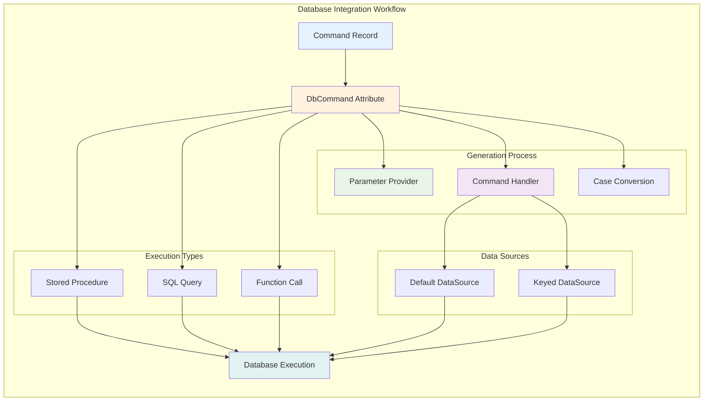

# Database Integration

The Platform provides a comprehensive database integration layer built on top of Dapper, featuring source-generated command handlers, strongly-typed parameter mapping, and optimized stored procedure execution. You get the performance of Dapper with the convenience of automated code generation.

## Quick start

Define a command record and let the Platform generate the database access code:

[!code-csharp[](~/samples/database-integration/DbCommandExamples.cs#StoredProcedureCommand)]

This simple record generates:
- **Parameter mapping** method (`ToDbParams()`)
- **Command handler** for the stored procedure
- **Type-safe execution** with automatic parameter binding
- **Cancellation token support** for async operations

## Core concepts

### DbCommand attribute
The `[DbCommand]` attribute configures how your commands interact with the database through an automated workflow:



[!code-csharp[](~/samples/database-integration/DbCommandExamples.cs#SqlQueryCommand)]
[!code-csharp[](~/samples/database-integration/DbCommandExamples.cs#FunctionCommand)]

Key features:
- **Stored procedures** with `sp` parameter
- **SQL queries** with `sql` parameter  
- **Function calls** with `fn` parameter
- **Parameter case conversion** (snake_case, etc.)
- **Query vs non-query** execution modes
- **Named data sources** for multi-database scenarios

### Parameter providers
Commands implement `IDbParamsProvider` through source generation:

[!code-csharp[](~/samples/database-integration/ParameterProvider.cs)]

The generated `ToDbParams()` method:
- Maps record properties to database parameters
- Handles case conversion automatically
- Supports custom column names with `[Column]` attribute
- Provides type-safe parameter binding

### Command handlers
Handlers are generated for commands that specify database operations:

[!code-csharp[](~/samples/database-integration/CommandHandlers.cs)]

Generated handlers provide:
- Automatic parameter binding
- Connection management
- Cancellation token support
- Return type mapping
- Error handling integration

## Stored procedure support

### Simple stored procedures
Execute stored procedures with minimal code:

[!code-csharp[](~/samples/database-integration/StoredProcedures.cs)]

### Complex parameter mapping
Handle complex scenarios with custom column names:

[!code-csharp[](~/samples/database-integration/ComplexParameters.cs)]

### Multiple result sets
Work with stored procedures that return multiple result sets:

[!code-csharp[](~/samples/database-integration/MultipleResultSets.cs)]

## SQL query support

### Dynamic queries
Execute parameterized SQL queries:

[!code-csharp[](~/samples/database-integration/SqlQueries.cs)]

### Function calls
Call database functions with automatic parameter generation:

[!code-csharp[](~/samples/database-integration/FunctionCalls.cs)]

The `fn` parameter automatically appends parameters based on record properties.

## Data source management

### Single data source
Configure a single database connection:

[!code-csharp[](~/samples/database-integration/SingleDataSource.cs)]

### Multiple data sources
Support multiple databases with keyed services:

[!code-csharp[](~/samples/database-integration/MultipleDataSources.cs)]

### Connection pooling
Leverage built-in connection pooling for optimal performance:

[!code-csharp[](~/samples/database-integration/ConnectionPooling.cs)]

## Parameter case conversion

### Snake case conversion
Automatically convert C# property names to database conventions:

[!code-csharp[](~/samples/database-integration/DbCommandExamples.cs#SnakeCaseMapping)]

### Custom column names
Override automatic naming with explicit column attributes:

[!code-csharp[](~/samples/database-integration/DbCommandExamples.cs#CustomColumnNames)]

### Global settings
Configure default parameter case conversion:

```xml
<PropertyGroup>
  <DbCommandDefaultParamCase>SnakeCase</DbCommandDefaultParamCase>
</PropertyGroup>
```

## Query vs non-query execution

### Non-query operations
Commands that modify data and return affected row counts:

[!code-csharp[](~/samples/database-integration/NonQueryOperations.cs)]

### Query operations
Commands that return data:

[!code-csharp[](~/samples/database-integration/QueryOperations.cs)]

### Scalar queries
Commands that return single values:

[!code-csharp[](~/samples/database-integration/ScalarQueries.cs)]

## Performance optimizations

### Connection reuse
Efficient connection management with `DbDataSource`:

[!code-csharp[](~/samples/database-integration/ConnectionReuse.cs)]

### Compile-time generation
Zero runtime overhead with source-generated code:

[!code-csharp[](~/samples/database-integration/CompileTimeGeneration.cs)]

### Bulk operations
Optimize bulk data operations:

[!code-csharp[](~/samples/database-integration/BulkOperations.cs)]

## Error handling

### Database exceptions
Handle database-specific errors:

[!code-csharp[](~/samples/database-integration/ErrorHandling.cs)]

### Connection failures
Implement retry policies for connection issues:

[!code-csharp[](~/samples/database-integration/RetryPolicies.cs)]

### Transaction management
Coordinate transactions across operations:

[!code-csharp[](~/samples/database-integration/TransactionManagement.cs)]

## Testing strategies

### Unit testing commands
Test command parameter generation:

[!code-csharp[](~/samples/database-integration/UnitTesting.cs)]

### Integration testing
Test complete database operations:

[!code-csharp[](~/samples/database-integration/IntegrationTesting.cs)]

### Database fixtures
Use TestContainers for reliable database testing:

[!code-csharp[](~/samples/database-integration/DatabaseFixtures.cs)]

## Best practices

- **Use records** for immutable command definitions
- **Implement ICommand<T>** for handler generation
- **Choose appropriate execution modes** (query vs non-query)
- **Use keyed data sources** for multi-database scenarios
- **Follow naming conventions** for parameter mapping
- **Include cancellation tokens** in all async operations
- **Test database interactions** with integration tests

## Common scenarios

### CRUD operations
Implement complete CRUD functionality:

[!code-csharp[](~/samples/database-integration/CrudOperations.cs)]

### Audit logging
Track data changes with generated commands:

[!code-csharp[](~/samples/database-integration/AuditLogging.cs)]

### Reporting queries
Execute complex reporting queries:

[!code-csharp[](~/samples/database-integration/ReportingQueries.cs)]

## Migration from raw Dapper

Gradually migrate existing Dapper code to use Platform features:

### Before (raw Dapper)
[!code-csharp[](~/samples/database-integration/BeforeMigration.cs)]

### After (Platform)
[!code-csharp[](~/samples/database-integration/AfterMigration.cs)]

## Source generator configuration

### MSBuild properties
Configure source generation behavior:

```xml
<PropertyGroup>
  <DbCommandDefaultParamCase>SnakeCase</DbCommandDefaultParamCase>
  <DbCommandGenerateNullableContext>true</DbCommandGenerateNullableContext>
</PropertyGroup>
```

### Analyzer rules
Control source generator warnings and errors:

```xml
<PropertyGroup>
  <WarningsAsErrors />
  <WarningsNotAsErrors>OPEXT001;OPEXT002</WarningsNotAsErrors>
</PropertyGroup>
```

## Next steps

- Learn about [Dapper Extensions](dapper-extensions.md) for advanced scenarios
- Explore [Source Generators](source-generators.md) in detail
- Understand [Messaging](../messaging/overview.md) for CQRS patterns
- Review [API development](../api/overview.md) for complete application architecture

## Additional resources

- [Dapper Documentation](https://github.com/DapperLib/Dapper)
- [DbDataSource Documentation](https://learn.microsoft.com/en-us/dotnet/api/system.data.common.dbdatasource)
- [Source Generators Overview](https://learn.microsoft.com/en-us/dotnet/csharp/roslyn-sdk/source-generators-overview)
- [System.Data.Common](https://learn.microsoft.com/en-us/dotnet/api/system.data.common)