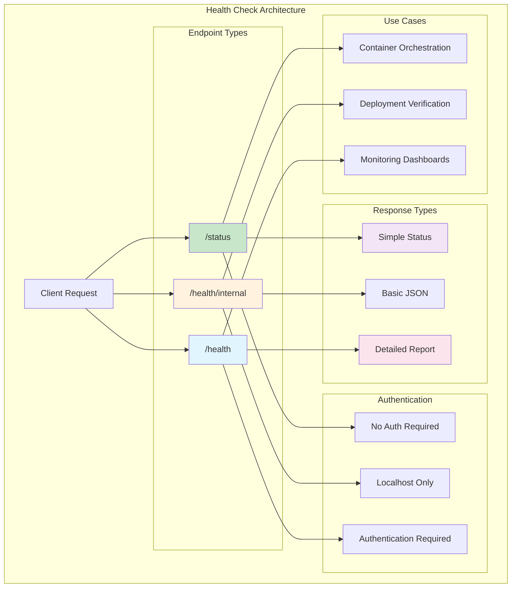

# Health Checks

The Platform provides comprehensive health check capabilities with multiple endpoints optimized for different scenarios - from lightweight liveness probes to detailed health status reporting. You get production-ready monitoring infrastructure with minimal configuration.

## Quick start

Health checks are automatically configured when you add Service Defaults:

[!code-csharp]

This setup provides:
- **Liveness probe** at `/status` for container orchestration
- **Readiness probe** at `/health/internal` for deployment verification  
- **Detailed health check** at `/health` for monitoring dashboards
- **Automatic logging** of health check results
- **JSON response format** with comprehensive status information

## Health check endpoints

The Platform provides three distinct health check endpoints optimized for different monitoring scenarios:

### Liveness probe (/status)
Lightweight endpoint for container liveness checks:

[!code-csharp]

Liveness probe characteristics:
- **Fast response** - returns cached status without executing checks
- **Simple output** - just the health status string
- **No authentication** required for container orchestrators
- **Minimal overhead** for high-frequency polling

### Readiness probe (/health/internal)
Container-only endpoint for deployment readiness:

[!code-csharp]

Readiness probe features:
- **Localhost-only** access for security
- **Executes health checks** to verify application readiness
- **Simplified output** in production environments
- **Detailed output** in development for debugging

### Health status endpoint (/health)
Comprehensive health information for monitoring:

[!code-csharp]

Health status provides:
- **Detailed health report** with individual check results
- **Authorization required** for security
- **JSON format** with status, duration, and error information
- **Data collection** from each health check

## Custom health checks

### Database health checks
Monitor database connectivity and performance:

[!code-csharp]

Database health checks verify:
- **Connection availability** to primary and secondary databases
- **Query execution** performance within acceptable limits
- **Connection pool** health and utilization
- **Transaction capability** for write operations

### External service health checks
Monitor dependencies on external services:

[!code-csharp]

External service checks include:
- **HTTP endpoint** availability and response times
- **Authentication service** connectivity
- **Message queue** broker availability
- **Cache service** responsiveness

### Custom business logic checks
Implement application-specific health validations:

[!code-csharp]

Business logic checks can verify:
- **Critical business rules** are functioning
- **Data consistency** across systems
- **License validation** and expiration
- **Feature flag** service availability

## Health check configuration

### Tags and filtering
Organize health checks with tags for different scenarios:

[!code-csharp]

Tag-based filtering enables:
- **Environment-specific** checks (development vs production)
- **Component-based** grouping (database, cache, external)
- **Criticality levels** (critical vs optional)
- **Custom endpoint** configuration for different consumers

### Timeout and retry configuration
Configure resilience for health check execution:

[!code-csharp]

Timeout configuration includes:
- **Per-check timeouts** to prevent hanging
- **Global timeout** for overall health check execution
- **Retry policies** for transient failures
- **Circuit breaker** patterns for failing dependencies

### Health check intervals
Control when and how often health checks execute:

[!code-csharp]

Interval configuration provides:
- **Background execution** separate from endpoint requests
- **Configurable periods** for different check types
- **Health result caching** for performance
- **Failure threshold** configuration

## Response formats

### JSON health report format
Detailed JSON structure for monitoring tools:

[!code-csharp]

JSON response includes:
- **Overall status** (Healthy, Degraded, Unhealthy)
- **Total duration** for all health checks
- **Individual check details** with status and timing
- **Error information** for failed checks
- **Custom data** from health check implementations

### Status codes and responses
HTTP status codes for different health states:

[!code-csharp]

Status code mapping:
- **200 OK** - All health checks pass
- **503 Service Unavailable** - Critical health checks fail
- **200 OK with Degraded** - Non-critical checks fail but service operational
- **Custom status codes** for specific scenarios

## Integration with monitoring

### Application Insights integration
Send health check data to Application Insights:

[!code-csharp]

Application Insights benefits:
- **Automated alerting** on health check failures
- **Historical trending** of health check performance
- **Correlation** with other application telemetry
- **Dashboard visualization** of health metrics

### Prometheus metrics
Expose health check metrics for Prometheus scraping:

[!code-csharp]

Prometheus metrics include:
- **Health check duration** histograms
- **Success/failure counters** by check name
- **Health status gauges** for real-time monitoring
- **Custom business metrics** from health checks

### Custom health check publishers
Send health data to custom monitoring systems:

[!code-csharp]

Custom publishers enable:
- **Integration** with existing monitoring infrastructure
- **Custom alert logic** based on health check results
- **Data transformation** for different monitoring formats
- **Batching and filtering** of health check data

## Container orchestration

### Kubernetes integration
Configure health checks for Kubernetes deployments:

[!code-csharp]

Kubernetes integration provides:
- **Liveness probes** to restart unhealthy containers
- **Readiness probes** to control traffic routing
- **Startup probes** for slow-starting applications
- **Custom probe configuration** for specific needs

### Docker Compose health checks
Health check configuration for Docker Compose:

[!code-csharp]

Docker Compose features:
- **Health check intervals** and timeouts
- **Dependency management** based on health status
- **Service discovery** integration
- **Development environment** optimization

## Testing strategies

### Health check testing
Test health check implementations in isolation:

[!code-csharp]

Testing approaches include:
- **Unit testing** individual health check logic
- **Integration testing** with real dependencies
- **Mock testing** for external service dependencies
- **Performance testing** for health check overhead

### End-to-end health validation
Validate complete health check pipeline:

[!code-csharp]

End-to-end testing covers:
- **Endpoint accessibility** and response format
- **Authentication** and authorization requirements
- **Performance characteristics** under load
- **Failure scenarios** and error handling

## Best practices

- **Keep health checks simple** and fast-executing
- **Use appropriate timeouts** to prevent cascading failures
- **Tag health checks** for different consumption scenarios
- **Monitor health check performance** itself
- **Implement graceful degradation** for non-critical dependencies
- **Use caching** for expensive health check operations
- **Include business logic** validation where appropriate
- **Test health checks** as part of your deployment pipeline

## Common scenarios

### Microservice dependency health
Monitor dependencies between microservices:

[!code-csharp]

### Database cluster health
Monitor database cluster status and failover:

[!code-csharp]

### Message queue health
Monitor message queue depth and processing:

[!code-csharp]

## Troubleshooting

### Common health check issues
Diagnose and resolve health check problems:

[!code-csharp]

### Performance optimization
Optimize health check execution performance:

[!code-csharp]

### Debugging health failures
Debug failing health checks effectively:

[!code-csharp]

## Next steps

- Learn about [Health Check Setup](setup.md) for advanced configuration
- Explore [Logging](../logging/overview.md) for health check logging patterns
- Understand [OpenTelemetry](../opentelemetry/overview.md) integration
- Review [API development](../api/overview.md) for health endpoint customization

## Additional resources

- [ASP.NET Core Health Checks](https://learn.microsoft.com/en-us/aspnet/core/host-and-deploy/health-checks)
- [Kubernetes Health Checks](https://kubernetes.io/docs/tasks/configure-pod-container/configure-liveness-readiness-startup-probes/)
- [Docker Health Checks](https://docs.docker.com/engine/reference/builder/#healthcheck)
- [Application Insights Health Checks](https://learn.microsoft.com/en-us/azure/azure-monitor/app/monitor-web-app-availability)