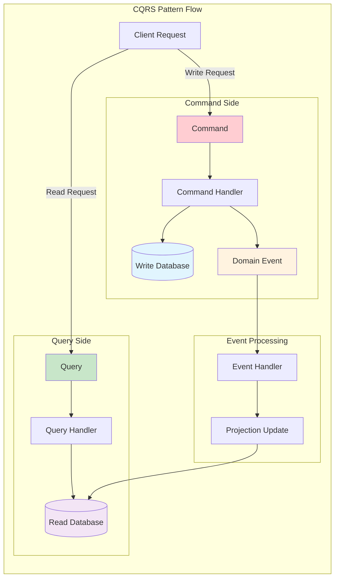
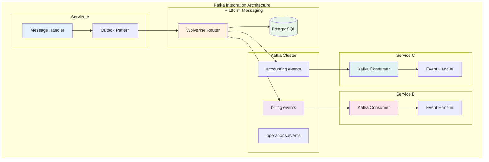
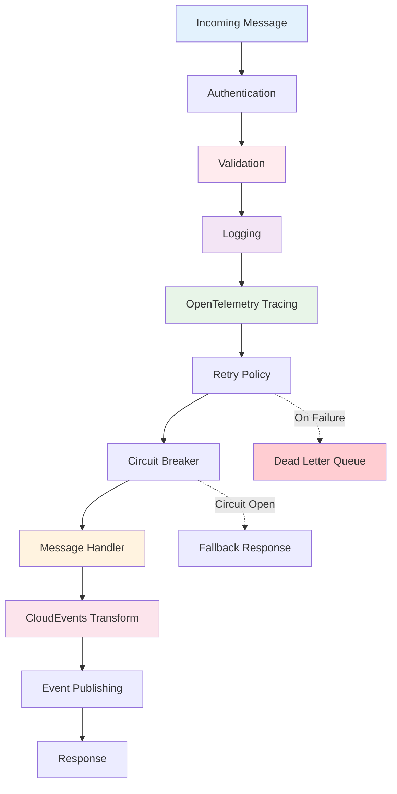

# Messaging

The Platform provides a comprehensive messaging foundation built on Wolverine, enabling event-driven architecture with CQRS patterns, reliable message delivery, and seamless integration with PostgreSQL and Kafka. You get production-ready messaging infrastructure with minimal configuration.

## Quick start

Enable messaging in your application with built-in reliability and observability:

This setup provides:

-   **CQRS command and query handling** with automatic discovery
-   **PostgreSQL persistence** for reliable message delivery
-   **Kafka integration** for external messaging
-   **CloudEvents** for standardized event formats
-   **Built-in middleware** for validation, telemetry, and error handling
-   **Transactional outbox pattern** for consistency

## Core concepts

### Command and Query Separation (CQRS)

Separate commands (write operations) from queries (read operations):

CQRS benefits:

-   **Clear separation** of concerns
-   **Independent scaling** of read and write operations
-   **Optimized data models** for specific use cases
-   **Event sourcing** capabilities

### Message handlers

Implement handlers for commands, queries, and events:

Handler features:

-   **Automatic discovery** via assembly scanning
-   **Dependency injection** support
-   **Return value handling** for queries
-   **Side effect management** for commands

### Event-driven communication

Publish events for loosely coupled communication:

Event benefits:

-   **Loose coupling** between services
-   **Scalable architecture** with async processing
-   **Audit trail** of system changes
-   **Integration** with external systems

## PostgreSQL persistence

### Reliable messaging

Messages are persisted to PostgreSQL for guaranteed delivery:

Reliability features:

-   **Transactional outbox** pattern
-   **Automatic retries** with exponential backoff
-   **Dead letter queues** for failed messages
-   **Message deduplication** to prevent duplicate processing

### Queue configuration

Configure message queues for optimal performance:

Queue features:

-   **Inbound/outbound** queue separation
-   **Configurable concurrency** limits
-   **Message prioritization** support
-   **Automatic provisioning** of database objects

### Schema management

Wolverine automatically manages database schema:

Schema features:

-   **Per-service schemas** for isolation
-   **Automatic provisioning** of tables and functions
-   **Migration support** for schema changes
-   **Multi-tenant** schema patterns

## Kafka integration

### External messaging

Connect to Kafka for inter-service communication:

Kafka features:

-   **High-throughput** message processing
-   **Topic-based** message routing
-   **Consumer group** management
-   **Health checks** for monitoring

### Topic naming conventions

Consistent topic naming across services:

Naming benefits:

-   **Consistent** topic structure
-   **Service-specific** namespace isolation
-   **Event type** identification
-   **Version management** support

## CloudEvents support

### Standardized event format

Use CloudEvents specification for interoperability:

CloudEvents provides:

-   **Standard metadata** for all events
-   **Interoperability** with other systems
-   **Tracing correlation** across services
-   **Content negotiation** support

### Event metadata

Rich metadata for event processing:

Metadata includes:

-   **Event source** identification
-   **Event type** classification
-   **Trace correlation** IDs
-   **Timestamp** information

## Middleware pipeline

### Built-in middleware

The Platform includes essential middleware components in a structured pipeline:

Middleware provides:

-   **Exception handling** with retry policies
-   **FluentValidation** for input validation
-   **Performance monitoring** with metrics
-   **OpenTelemetry** integration for tracing
-   **CloudEvents** transformation

### Custom middleware

Add application-specific middleware:

Custom middleware enables:

-   **Authorization** checks
-   **Custom logging** and auditing
-   **Rate limiting** policies
-   **Circuit breaker** patterns

### Middleware ordering

Control middleware execution order:

Ordering considerations:

-   **Authentication** before authorization
-   **Validation** before business logic
-   **Logging** spans entire pipeline
-   **Error handling** wraps other middleware

## Error handling and resilience

### Exception policies

Configure how different exceptions are handled:

Exception handling features:

-   **Retry policies** with exponential backoff
-   **Dead letter queues** for persistent failures
-   **Custom error responses** for validation failures
-   **Structured logging** of errors

### Circuit breaker patterns

Prevent cascade failures with circuit breakers:

Circuit breaker benefits:

-   **Fail fast** during outages
-   **Automatic recovery** detection
-   **Cascade failure** prevention
-   **Graceful degradation** support

### Saga patterns

Coordinate long-running processes:

Saga features:

-   **State persistence** across steps
-   **Compensation** for rollback scenarios
-   **Timeout handling** for stuck processes
-   **Event-driven** state transitions

## Performance optimization

### Message batching

Process messages in batches for better throughput:

Batching benefits:

-   **Higher throughput** for bulk operations
-   **Reduced database** roundtrips
-   **Better resource** utilization
-   **Configurable batch** sizes

### Connection pooling

Efficient database connection management:

Connection pooling provides:

-   **Resource efficiency** with shared connections
-   **Automatic scaling** based on load
-   **Connection health** monitoring
-   **Timeout management** for idle connections

### Serialization optimization

Efficient message serialization:

Serialization features:

-   **System.Text.Json** for performance
-   **Custom converters** for complex types
-   **Minimal allocations** during processing
-   **Schema evolution** support

## Testing strategies

### Unit testing handlers

Test message handlers in isolation:

### Integration testing

Test complete message flows:

### Test doubles

Use test doubles for external dependencies:

## Configuration options

### Environment-specific settings

Configure messaging for different environments:

### Service bus options

Comprehensive configuration options:

Configuration includes:

-   **Connection strings** for databases and Kafka
-   **Queue settings** for throughput and concurrency
-   **Retry policies** for error handling
-   **Serialization options** for message formats

## Observability integration

### Metrics collection

Automatic metrics for message processing:

Metrics include:

-   **Message throughput** rates
-   **Processing latency** histograms
-   **Error rates** by message type
-   **Queue depth** monitoring

### Distributed tracing

End-to-end tracing across services:

Tracing provides:

-   **Request correlation** across services
-   **Performance bottleneck** identification
-   **Error propagation** tracking
-   **Service dependency** mapping

## Best practices

-   **Use CQRS** to separate read and write concerns
-   **Implement idempotent** message handlers
-   **Design for eventual** consistency
-   **Use CloudEvents** for interoperability
-   **Configure appropriate** retry policies
-   **Monitor message** processing metrics
-   **Test message handlers** thoroughly
-   **Version your** message contracts

## Common patterns

### Event sourcing

Store events as the source of truth:

### Outbox pattern

Ensure consistency between database updates and message publishing:

### Request-response pattern

Implement synchronous request-response over messaging:

## Migration strategies

### From direct database calls

Gradually introduce messaging patterns:

### From other messaging systems

Migrate from existing messaging infrastructure:

## Next steps

-   Learn about [Wolverine Integration](wolverine-setup.md) in detail
-   Explore [CloudEvents](cloudevents/overview.md) for standardized events
-   Understand [Kafka](kafka/overview.md) configuration and patterns
-   Review [Middlewares](middlewares/overview.md) for cross-cutting concerns
-   Study [Telemetry](telemetry/overview.md) for monitoring and observability

## Additional resources

-   [Wolverine Documentation](https://wolverine.netlify.app/)
-   [CloudEvents Specification](https://cloudevents.io/)
-   [Apache Kafka Documentation](https://kafka.apache.org/documentation/)
-   [CQRS Pattern](https://learn.microsoft.com/en-us/azure/architecture/patterns/cqrs)
