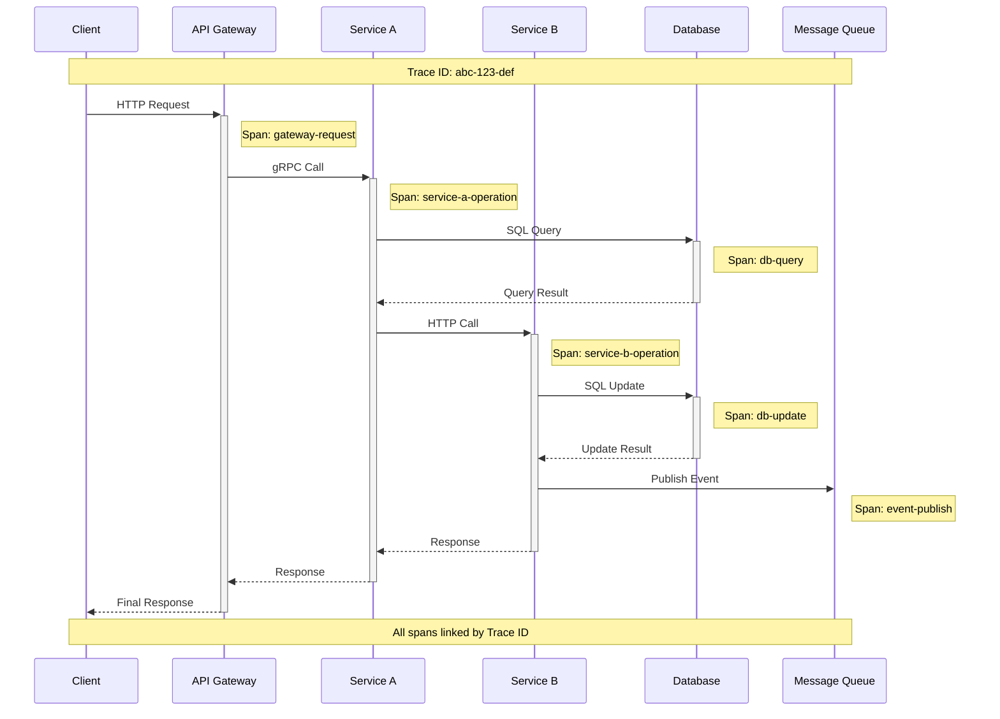

# OpenTelemetry

The Platform provides comprehensive OpenTelemetry integration with automatic instrumentation, distributed tracing, metrics collection, and seamless export to observability platforms. You get production-ready observability infrastructure that scales across your entire microservices architecture.

## Quick start

OpenTelemetry is automatically configured when you add Service Defaults:

[!code-csharp]

This setup provides:
- **Distributed tracing** across service boundaries
- **Metrics collection** for performance monitoring
- **Automatic instrumentation** for ASP.NET Core and HTTP clients
- **OTLP export** to observability platforms
- **Logging integration** with trace correlation

## Core OpenTelemetry features

### Distributed tracing
Track requests across multiple services and components:

[!code-csharp]

Distributed tracing provides:
- **End-to-end visibility** across service boundaries
- **Request correlation** with unique trace IDs
- **Performance bottleneck** identification
- **Dependency mapping** of service interactions

### Metrics collection
Monitor application performance and business metrics:

[!code-csharp]

Metrics collection includes:
- **System metrics** (CPU, memory, GC)
- **HTTP metrics** (request rate, duration, errors)
- **Custom business metrics** for KPI monitoring
- **Runtime instrumentation** for .NET performance

### Activity sources and meters
Create custom instrumentation for your application:

[!code-csharp]

Custom instrumentation enables:
- **Business operation** tracing
- **Domain-specific metrics** collection
- **Custom span attributes** for rich context
- **Hierarchical activity** tracking

## Automatic instrumentation

### ASP.NET Core instrumentation
Comprehensive web application tracing:

[!code-csharp]

ASP.NET Core instrumentation captures:
- **HTTP request/response** details
- **Route information** and controller actions
- **Authentication** and authorization events
- **Exception handling** and error status

### HTTP client instrumentation
Monitor outbound HTTP calls and dependencies:

[!code-csharp]

HTTP client instrumentation tracks:
- **Outbound request** timing and status
- **Dependency failure** rates and patterns
- **Circuit breaker** and retry behavior
- **Service-to-service** communication patterns

### Database instrumentation
Monitor database operations and performance:

[!code-csharp]

Database instrumentation provides:
- **SQL query** execution timing
- **Connection pool** utilization
- **Database transaction** tracking
- **Query performance** analysis

## Custom telemetry

### Custom activities and spans
Create detailed traces for business operations:

[!code-csharp]

Custom activities enable:
- **Business process** tracing
- **Long-running operation** monitoring
- **Complex workflow** visualization
- **Cross-cutting concern** instrumentation

### Custom metrics and counters
Track business and operational metrics:

[!code-csharp]

Custom metrics support:
- **Business KPI** monitoring
- **Application performance** indicators
- **Resource utilization** tracking
- **Error rate** and success metrics

### Baggage and context propagation
Pass contextual information across service boundaries:

[!code-csharp]

Context propagation enables:
- **User context** preservation
- **Tenant information** tracking
- **Feature flag** state propagation
- **Custom correlation** data

## Observability platforms

### OTLP export configuration
Export telemetry data to OpenTelemetry-compatible platforms:

[!code-csharp]

OTLP export supports:
- **Jaeger** for distributed tracing
- **Prometheus** for metrics collection
- **Grafana** for visualization dashboards
- **Commercial platforms** (Datadog, New Relic, etc.)

### Azure Monitor integration
Send telemetry to Azure Application Insights:

[!code-csharp]

Azure Monitor integration provides:
- **Application Map** visualization
- **Live Metrics** streaming
- **Dependency tracking** across Azure services
- **Alert rules** based on telemetry data

### Jaeger integration
Export traces to Jaeger for analysis:

[!code-csharp]

Jaeger integration enables:
- **Trace visualization** and analysis
- **Service dependency** mapping
- **Performance optimization** insights
- **Historical trace** comparison

## Sampling and filtering

### Sampling strategies
Control telemetry volume with intelligent sampling:

[!code-csharp]

Sampling strategies include:
- **Head-based sampling** for early decisions
- **Tail-based sampling** for error prioritization
- **Adaptive sampling** based on load
- **Custom sampling** rules per operation

### Filtering configuration
Reduce noise and focus on important telemetry:

[!code-csharp]

Filtering capabilities:
- **Health check** exclusion from traces
- **Internal endpoint** filtering
- **Sensitive data** redaction
- **Performance-critical path** optimization

### Resource configuration
Configure resource attributes for telemetry identification:

[!code-csharp]

Resource configuration includes:
- **Service identification** attributes
- **Environment** and deployment information
- **Version** and build metadata
- **Custom resource** attributes

## Performance optimization

### Batching and buffering
Optimize telemetry export performance:

[!code-csharp]

Batching optimizations:
- **Batch size** tuning for throughput
- **Export intervals** for latency balance
- **Memory management** for resource efficiency
- **Backpressure handling** for high load

### Instrumentation overhead
Minimize performance impact of observability:

[!code-csharp]

Overhead reduction techniques:
- **Selective instrumentation** for critical paths
- **Lazy initialization** of expensive operations
- **Pool allocation** for frequent objects
- **Fast path optimization** for hot code

### Memory management
Efficient memory usage for telemetry collection:

[!code-csharp]

Memory optimizations:
- **Object pooling** for activity and span objects
- **String interning** for repeated attribute values
- **Circular buffers** for metrics aggregation
- **GC pressure** reduction strategies

## Security and compliance

### Sensitive data protection
Prevent exposure of sensitive information in telemetry:

[!code-csharp]

Data protection features:
- **PII redaction** from spans and logs
- **URL parameter** scrubbing
- **Header filtering** for authentication tokens
- **Custom sanitization** rules

### Compliance and auditing
Meet regulatory requirements for observability data:

[!code-csharp]

Compliance capabilities:
- **Data retention** policies
- **Access control** for telemetry data
- **Audit trails** for data access
- **Geographic restrictions** for data export

## Testing and validation

### Telemetry testing
Validate observability instrumentation in tests:

[!code-csharp]

Testing approaches:
- **Activity assertion** in unit tests
- **Metrics verification** for business logic
- **Export validation** in integration tests
- **Performance testing** of instrumentation overhead

### Local development
Effective observability during development:

[!code-csharp]

Development features:
- **Console exporter** for immediate feedback
- **Local Jaeger** instance for trace visualization
- **Debug logging** for instrumentation issues
- **Sampling override** for comprehensive tracing

## Monitoring and alerting

### SLA monitoring
Monitor service level objectives with telemetry:

[!code-csharp]

SLA monitoring includes:
- **Error rate** tracking
- **Latency percentile** monitoring
- **Availability** calculations
- **Customer impact** measurement

### Custom alerting
Set up alerts based on telemetry data:

[!code-csharp]

Alerting capabilities:
- **Threshold-based** alerts
- **Anomaly detection** alerts
- **Composite condition** alerts
- **Business metric** alerts

### Dashboard creation
Build observability dashboards from telemetry:

[!code-csharp]

Dashboard features:
- **Real-time metrics** visualization
- **Trace search** and analysis
- **Service topology** maps
- **Custom business** dashboards

## Best practices

- **Instrument key business operations** beyond just HTTP requests
- **Use semantic conventions** for consistent attribute naming
- **Implement sampling** to control telemetry volume
- **Protect sensitive data** from accidental exposure
- **Monitor instrumentation overhead** in production
- **Correlate traces with logs** and metrics
- **Test telemetry code** as part of your pipeline
- **Document custom instrumentation** for team knowledge

## Common scenarios

### Microservice communication tracing
Track requests across multiple services:

[!code-csharp]

### Background job monitoring
Monitor long-running and scheduled operations:

[!code-csharp]

### Database performance analysis
Analyze database query performance and patterns:

[!code-csharp]

## Troubleshooting

### Common telemetry issues
Diagnose and resolve observability problems:

[!code-csharp]

### Export failures
Debug telemetry export problems:

[!code-csharp]

### Performance tuning
Optimize telemetry performance for production:

[!code-csharp]

## Next steps

- Learn about [OpenTelemetry Setup](setup.md) for advanced configuration
- Explore [Logging](../logging/overview.md) integration with traces
- Understand [Health Checks](../healthchecks/overview.md) observability
- Review [Messaging](../messaging/overview.md) telemetry patterns

## Additional resources

- [OpenTelemetry .NET Documentation](https://opentelemetry.io/docs/languages/net/)
- [OpenTelemetry Semantic Conventions](https://opentelemetry.io/docs/specs/semconv/)
- [OTLP Specification](https://opentelemetry.io/docs/specs/otlp/)
- [OpenTelemetry Collector](https://opentelemetry.io/docs/collector/)