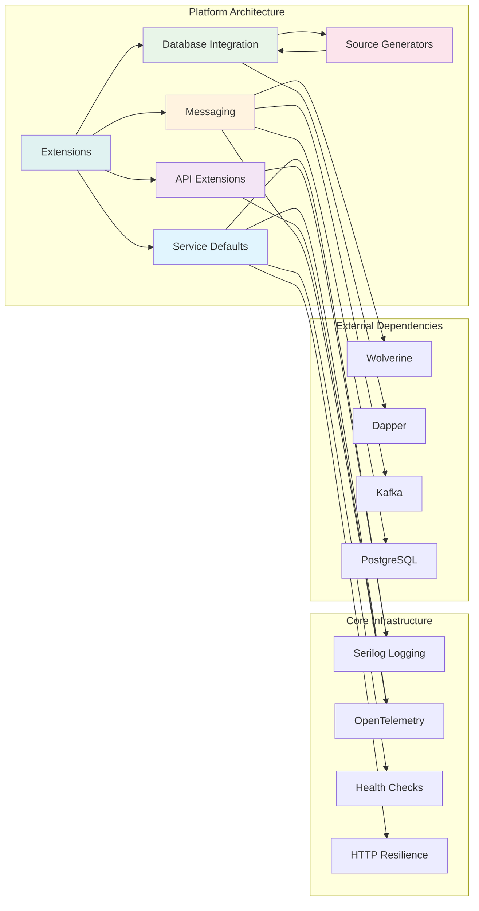

# Platform Overview

The Platform provides a comprehensive suite of .NET 9 libraries designed to streamline microservices development with built-in patterns for database access, messaging, observability, and API development. These libraries form the foundation for building scalable, maintainable distributed systems.

## What's included

The Platform consists of several focused libraries that work together to provide a cohesive development experience:



- **Service Defaults** - Common configuration patterns for logging, health checks, and OpenTelemetry
- **API Extensions** - Streamlined OpenAPI documentation and gRPC integration
- **Database Integration** - Dapper extensions with source-generated command handlers
- **Messaging** - Wolverine-based CQRS patterns with CloudEvents and Kafka support
- **Source Generators** - Compile-time code generation for reduced boilerplate
- **Extensions** - Utility libraries and result pattern implementations

## Key benefits

### Consistent patterns
All libraries follow established architectural patterns and conventions, ensuring consistency across services and teams.

### Reduced boilerplate
Source generators and extension methods eliminate repetitive code while maintaining type safety and performance.

### Built-in observability
Integrated OpenTelemetry, structured logging, and health checks provide production-ready monitoring out of the box.

### Microservices-ready
Designed specifically for distributed systems with service discovery, messaging, and API-first architecture.

## Getting started

The Platform is designed to be adopted incrementally. Start with the [Service Defaults](architecture/service-defaults.md) to establish common configuration patterns, then add specific libraries as needed:

```csharp
// Program.cs
var builder = WebApplication.CreateBuilder(args);

// Add platform service defaults
builder.AddServiceDefaults();

// Add specific platform features
builder.Services.AddOpenApiDocumentation();
builder.Services.AddWolverineMessaging();

var app = builder.Build();

// Configure platform middleware
app.MapDefaultEndpoints();
app.UseOpenApiDocumentation();

app.Run();
```

## Architecture principles

The Platform is built on several key architectural principles:

- **Convention over configuration** - Sensible defaults with customization options
- **Compile-time safety** - Source generators and strong typing prevent runtime errors
- **Performance-first** - Optimized for high-throughput scenarios
- **Cloud-native** - Designed for containerized and orchestrated environments

## Next steps

- Explore the [Architecture](architecture/overview.md) to understand the overall design
- Explore [API development](api/overview.md) patterns for building web services
- Learn about [Database integration](database-integration/overview.md) with Dapper extensions
- Understand [Messaging patterns](messaging/overview.md) for event-driven architecture

## Additional resources

- [.NET Aspire documentation](https://learn.microsoft.com/en-us/dotnet/aspire/)
- [Wolverine documentation](https://wolverine.netlify.app/)
- [OpenTelemetry .NET documentation](https://opentelemetry.io/docs/languages/net/)