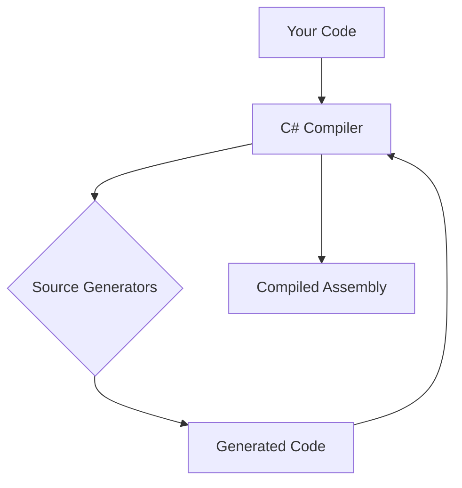

# Source Generators Overview

C# Source Generators are a powerful feature that allows you to inspect user code and generate new C# source files that are added to the compilation. The Platform extensively uses source generators to eliminate boilerplate code, enforce conventions, and improve performance without relying on runtime reflection or complex code weaving.

## Benefits of Source Generators

*   **Reduced Boilerplate**: Automatically generate repetitive code, such as mapping logic, command handlers, or configuration extensions.
*   **Improved Performance**: Generated code is compiled directly into your assembly, avoiding the overhead of runtime reflection.
*   **Compile-time Safety**: Errors are caught at compile time, providing immediate feedback to developers.
*   **Enhanced Developer Experience**: Generated code is visible in your IDE, allowing for better understanding and debugging.
*   **Convention Enforcement**: Enforce architectural patterns and naming conventions across your codebase.

## How Source Generators Work

Source generators run during the compilation process. They receive a `Compilation` object, which represents the current state of your project, including all source files and references. The generator can then analyze this `Compilation` and emit new source code files.

1.  **Your Code**: You write your application code, potentially applying custom attributes or adhering to specific naming conventions that the source generator will recognize.
2.  **C# Compiler**: The compiler starts its process, including invoking any registered source generators.
3.  **Source Generators**: The generators analyze your code and, based on their logic, produce new C# files.
4.  **Generated Code**: These new files are added to the compilation.
5.  **Compiled Assembly**: The compiler then compiles both your original code and the generated code into the final assembly.

## Key Source Generators in Platform

The Platform includes several source generators to automate common tasks. One prominent example is the `DbCommandSourceGenerator`.

### DbCommandSourceGenerator

The `DbCommandSourceGenerator` automatically generates Dapper-based command and query handlers from classes decorated with the `[DbCommand]` attribute. This significantly reduces the amount of manual code required to interact with databases.

## See also

*   [DbCommandAttribute](../database/dbcommand-attribute.md)
*   [C# Source Generators Documentation](https://learn.microsoft.com/en-us/dotnet/csharp/roslyn-sdk/source-generators-overview)
