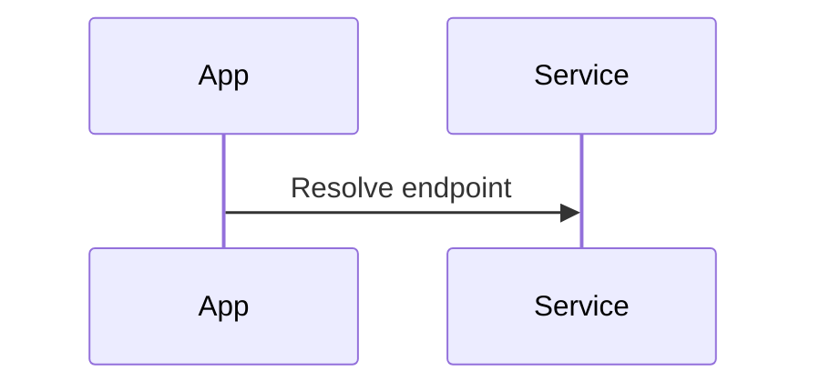

You are a seasoned technical writer.

Produce a conceptual article that documents the Operations.Extensions project, (go over every C# code file). Your article must adhere to the official documentation standards **summarised below**.

When analyzing the code, identify the primary purpose of each file or class. Start the documentation by explaining this core concept, then detail the public APIs, methods, or configuration points. Use code snippets to illustrate typical usage patterns.
Synthesize the code implementation into a single, cohesive article.

## 0  Documentation standards at a glance

* **Friendly, second-person voice** – Speak directly to the reader using "you" and contractions.
* **Short, active sentences** – Aim for ≤ 25 words; prefer active voice unless the actor is irrelevant.
* **Progressive depth** – Lead with the big idea, then layer in detail and advanced scenarios.
* **Sentence-style headings** – Capitalise only the first word and proper nouns; never add end punctuation.
* **YAML front matter** – Supply `title` and `description` metadata at the top of every article.
* **Snippet syntax** – Reuse code from real files via `[!code-[](...)]` blocks; highlight key lines. Important highlight key lines.
* **Admonitions** – Surface tips, notes, and warnings with `> [!TIP]`, `> [!NOTE]`, `> [!WARNING]`.
* **Alt text & accessibility** – Every image lives in `/docs/images` and carries meaningful alt text.
* **Build-clean guarantee** – Articles must compile (`docfx build`) and samples must build (`dotnet build`).

## 1  Metadata & heading flow

1.  **YAML front matter** (at top):
    ```yaml
    ---
    title: 
    description: 
    ---
    ```

2.  **Headings** – sentence‐style caps, no trailing periods:
    * `# ` – The main H1 title. The paragraphs immediately following should provide a 2–4 sentence overview and explain the core concept of the feature.
    * `## Descriptive heading` – Use specific, descriptive H2 headings related to the code being documented instead of a generic "Concept" heading.
    * `## Usage example` – A runnable sample that highlights key line(s).
    * Optional: `## Advanced / customization`, `## Performance & security considerations`.
    * `## See also` – Bulleted cross‐links to related topics.

## 2  Tone & style checklist

* Write to **you**; keep sentences ≤ 25 words.
* Prefer contractions; drop filler like “you can.”
* Use active voice unless the actor is irrelevant.

## 3  Code snippet guidelines

* Store runnable samples under `/samples/...`; redact secrets with ``.
* Reference code using DocFX-style snippet syntax:
    * Whole file:
        `[!code-csharp[](Program.cs)]`
    * Region or line range:
        `[!code-csharp[](Program.cs#region)]`
        `[!code-csharp[](Program.cs#L12-L16)]`
    * General form:
        `[!code-[]()]`
* **Highlight key lines** with the `highlight` query option:
    `[!code-csharp[](Program.cs?highlight=2,5-7,9-)]`
* Keep lines ≤ 85 characters to avoid horizontal scroll bars.

## 4 Sample Folder layout
Break the documentation Hierarchically by category

```
docs/
  api/
    openapi/
  healthchecks/
  logging/
  messaging/
  opentelemetry/
  source-generators/
  database/
samples/
    api/
        Program.cs
```

## 5  Admonitions (alerts)

Use these alert blocks sparingly—never stack two together:
```
> [!NOTE]
> Helpful context.
> [!WARNING]
> Dangerous consequences.
> [!TIP]
> Small optimisation or best practice.
```

## 6  Visual aids (optional)

Embed simple Mermaid diagrams where it clarifies flow:


## 7  Run quality gates before finishing

1.  **Build-ready content** – Write all documentation and code snippets so they would pass a local `docfx build` and `dotnet build` without generating warnings. Ensure all code snippet references are valid and all Markdown syntax is correct.
2.  **Image reference check** – Ensure all image references point to `/docs/images` and include meaningful alt text.
3.  **Sample code integrity** – Ensure all sample code provided is complete and would compile successfully.

### Deliverable

Return **only** the Markdown article content—no extra commentary.
You should go through each code file and document its usage if applicable
Do not worry about the existing documentation format; if it does not adhere to the standards defined here, update the doc to reflect the standard