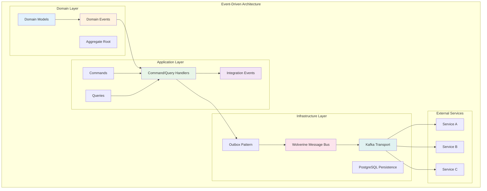
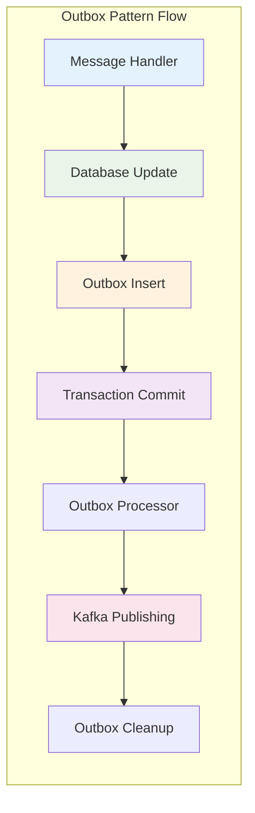

# Event-Driven Architecture

This document provides a comprehensive guide to implementing event-driven architecture patterns within the Platform, using the Billing domain as a reference implementation. The architecture demonstrates how to build scalable, loosely-coupled systems using domain events, integration events, and message-driven communication.

## Architecture Overview

The event-driven architecture in the Platform follows a layered approach with clear separation between domain logic, application services, and infrastructure concerns:



## Billing Domain Implementation

The Billing domain demonstrates key event-driven patterns through its implementation of Invoice and Cashier aggregates.

### Domain Structure

The Billing domain follows a clean architecture with distinct layers:

```
src/Billing/
├── Core/
│   └── Data/
│       └── Entity.cs                 # Base entity with audit fields
├── Invoices/
│   ├── Commands/                     # Command operations
│   │   ├── CreateInvoice.cs         # CreateInvoiceCommand + Handler
│   │   ├── CancelInvoice.cs         # CancelInvoiceCommand + Handler
│   │   ├── MarkInvoiceAsPaid.cs     # MarkInvoiceAsPaidCommand + Handler
│   │   └── SimulatePayment.cs       # SimulatePaymentCommand + Handler
│   ├── Contracts/
│   │   ├── DomainEvents/            # Internal domain events
│   │   │   └── InvoiceGenerated.cs  # InvoiceGenerated domain event
│   │   ├── IntegrationEvents/       # Cross-service events
│   │   │   ├── InvoiceCancelled.cs  # External event notification
│   │   │   ├── InvoiceCreated.cs    # External event notification
│   │   │   ├── InvoiceFinalized.cs  # External event notification
│   │   │   ├── InvoicePaid.cs       # External event notification
│   │   │   └── PaymentReceived.cs   # External event notification
│   │   └── Models/
│   │       └── Invoice.cs           # Invoice contract model
│   ├── Data/
│   │   └── Entities/
│   │       └── Invoice.cs           # Invoice entity
│   └── Queries/
│       ├── GetInvoice.cs            # Single invoice query
│       └── GetInvoices.cs           # Multiple invoices query
└── Cashiers/
    ├── Commands/                     # Cashier commands
    ├── Contracts/
    │   ├── IntegrationEvents/       # Cashier integration events
    │   │   ├── CashierCreated.cs    # CashierCreated event
    │   │   ├── CashierDeleted.cs    # CashierDeleted event
    │   │   └── CashierUpdated.cs    # CashierUpdated event
    │   └── Models/
    │       ├── Cashier.cs           # Cashier contract model
    │       └── CashierPayment.cs    # Payment association model
    └── Data/
        └── Entities/
            ├── Cashier.cs           # Cashier entity
            └── CashierCurrency.cs   # Currency association entity
```

### Event Types and Patterns

The Billing domain implements two distinct event types:

#### 1. Domain Events

Domain events represent significant business occurrences within the domain boundary:

```csharp
// src/Billing/Invoices/Contracts/DomainEvents/InvoiceGenerated.cs
namespace Billing.Invoices.Contracts.DomainEvents;

public record InvoiceGenerated(Guid InvoiceId, decimal InvoiceAmount);
```

**Characteristics:**

-   Internal to the domain
-   Processed synchronously within the same transaction
-   Used for internal business logic coordination
-   No external dependencies

#### 2. Integration Events

Integration events enable communication between different bounded contexts:

```csharp
// src/Billing/Invoices/Contracts/IntegrationEvents/InvoiceCreated.cs
using Billing.Invoices.Contracts.Models;

namespace Billing.Invoices.Contracts.IntegrationEvents;

[EventTopic<Invoice>]
public record InvoiceCreated(Invoice Invoice);
```

**Characteristics:**

-   Cross-service communication
-   Processed asynchronously via message bus
-   Decorated with `[EventTopic<T>]` attribute for automatic routing
-   Follow CloudEvents specification

### Command Handler Pattern

The billing domain demonstrates the command handler pattern with the `CreateInvoiceCommand`:

```csharp
// src/Billing/Invoices/Commands/CreateInvoice.cs:43-78
public static async Task<(Result<InvoiceModel>, InvoiceCreated)> Handle(
    CreateInvoiceCommand command,
    IMessageBus messaging,
    CancellationToken cancellationToken)
{
    var invoiceId = Guid.CreateVersion7();
    const string status = "Draft";

    var insertCommand = new InsertInvoiceCommand(
        invoiceId,
        command.Name,
        status,
        command.Amount,
        command.Currency,
        command.DueDate,
        command.CashierId
    );

    await messaging.InvokeCommandAsync(insertCommand, cancellationToken);

    var result = new InvoiceModel
    {
        InvoiceId = invoiceId,
        Name = command.Name,
        Status = status,
        Amount = command.Amount,
        Currency = command.Currency,
        DueDate = command.DueDate,
        CashierId = command.CashierId,
        CreatedDateUtc = DateTime.UtcNow,
        UpdatedDateUtc = DateTime.UtcNow,
        Version = 1
    };

    var createdEvent = new InvoiceCreated(result);

    return (result, createdEvent);
}
```

**Key Features:**

-   Returns both the result and integration event
-   Uses database commands for persistence
-   Generates integration events for external communication
-   Implements validation through FluentValidation

## Messaging Infrastructure

The Platform's messaging infrastructure is built on Wolverine and provides automatic event discovery, routing, and processing.

### Integration Event Discovery

The system automatically discovers integration events using namespace conventions:

```csharp
// libs/Operations/src/Operations.ServiceDefaults/Messaging/Kafka/IntegrationEventsDiscovery.cs:91
private static bool IsIntegrationEventType(Type messageType) =>
    messageType.Namespace?.EndsWith(IntegrationEventsNamespace) == true;
```

**Discovery Rules:**

-   Events must be in namespaces ending with `.IntegrationEvents`
-   Events must be decorated with `[EventTopic]` attributes
-   Only events with handlers are automatically subscribed

### Event Topic Configuration

Events are configured using the `EventTopicAttribute`:

```csharp
// Billing/Cashiers/Contracts/IntegrationEvents/CashierCreated.cs:8
[EventTopic<Cashier>]
public record CashierCreated(
    [PartitionKey] Guid TenantId,
    [PartitionKey] int PartitionKeyTest,
    Cashier Cashier);
```

**Configuration Options:**

-   Generic `EventTopic<T>` derives topic from entity type
-   Explicit topic names with `EventTopic("topic-name")`
-   Domain specification for topic routing
-   Partition key attributes for Kafka partitioning

### Topic Naming Convention

The system generates fully qualified topic names following this pattern:

```
{environment}.{domain}.{scope}.{topic}.{version}
```

**Example Topics:**

-   `dev.billing.public.invoices.v1`
-   `prod.billing.internal.cashiers.v1`
-   `test.accounting.public.ledger-entries.v1`

**Implementation:**

```csharp
// libs/Operations/src/Operations.ServiceDefaults/Messaging/Kafka/KafkaIntegrationEventsExtensions.cs:156-177
private static string GetTopicName(Type messageType, EventTopicAttribute topicAttribute, string env)
{
    var envName = env switch
    {
        "Development" => "dev",
        "Production" => "prod",
        "Test" => "test",
        _ => env.ToLowerInvariant()
    };

    var domainName = !string.IsNullOrWhiteSpace(topicAttribute.Domain)
        ? topicAttribute.Domain
        : messageType.Assembly.GetAttribute<DefaultDomainAttribute>()!.Domain;

    var scope = topicAttribute.Internal ? "internal" : "public";
    var topicName = topicAttribute.ShouldPluralizeTopicName ? topicAttribute.Topic.Pluralize() : topicAttribute.Topic;
    var versionSuffix = string.IsNullOrWhiteSpace(topicAttribute.Version) ? null : $".{topicAttribute.Version}";

    return $"{envName}.{domainName}.{scope}.{topicName}{versionSuffix}".ToLowerInvariant();
}
```

### Kafka Integration

The Kafka integration provides:

#### Publisher Configuration

```csharp
// libs/Operations/src/Operations.ServiceDefaults/Messaging/Kafka/KafkaIntegrationEventsExtensions.cs:129-147
private static void SetupKafkaPublisherRoute<TEventType>(WolverineOptions options, string topicName)
{
    var partitionKeyGetter = PartitionKeyProviderFactory.GetPartitionKeyFunction<TEventType>();

    options
        .PublishMessage<TEventType>()
        .ToKafkaTopic(topicName)
        .CustomizeOutgoing(e =>
        {
            if (e.Message is IDistributedEvent integrationEvent)
            {
                e.PartitionKey = integrationEvent.GetPartitionKey();
            }
            else if (e.Message is not null && partitionKeyGetter is not null)
            {
                e.PartitionKey = partitionKeyGetter((TEventType)e.Message);
            }
        });
}
```

#### Subscriber Configuration

```csharp
// libs/Operations/src/Operations.ServiceDefaults/Messaging/Kafka/KafkaIntegrationEventsExtensions.cs:95-127
private void SetupSubscribers(WolverineOptions options)
{
    var integrationEventTypesWithHandlers = IntegrationEventsDiscovery.GetIntegrationEventTypesWithHandlers();
    var topicsToSubscribe = new HashSet<string>();

    foreach (var messageType in integrationEventTypesWithHandlers)
    {
        var topicAttribute = messageType.GetAttribute<EventTopicAttribute>();
        if (topicAttribute is null) continue;

        var topicName = GetTopicName(messageType, topicAttribute, environment.EnvironmentName);
        topicsToSubscribe.Add(topicName);
    }

    foreach (var topicName in topicsToSubscribe)
    {
        options.ListenToKafkaTopic(topicName);
    }
}
```

## Event Processing Pipeline

The Platform implements a comprehensive middleware pipeline for event processing:

```mermaid
graph TD
    subgraph "Event Processing Pipeline"
        MSG[Incoming Message] --> AUTH[Authentication]
        AUTH --> VAL[FluentValidation]
        VAL --> LOG[Logging Middleware]
        LOG --> TRACE[OpenTelemetry Tracing]
        TRACE --> RETRY[Retry Policy]
        RETRY --> CB[Circuit Breaker]
        CB --> HANDLER[Message Handler]
        HANDLER --> CLOUD[CloudEvents Transform]
        CLOUD --> PUB[Event Publishing]
        PUB --> OUTBOX[Outbox Pattern]
        OUTBOX --> KAFKA[Kafka Publishing]
        KAFKA --> RESP[Response]

        RETRY -.->|On Failure| DLQ[Dead Letter Queue]
        CB -.->|Circuit Open| FALLBACK[Fallback Response]

        style MSG fill:#e3f2fd
        style VAL fill:#ffebee
        style LOG fill:#f3e5f5
        style TRACE fill:#e8f5e8
        style HANDLER fill:#fff3e0
        style CLOUD fill:#fce4ec
        style DLQ fill:#ffcdd2
    end
```



### Middleware Components

#### 1. FluentValidation Middleware

Validates incoming commands and queries:

```csharp
// src/Billing/Invoices/Commands/CreateInvoice.cs:18-28
public class CreateInvoiceValidator : AbstractValidator<CreateInvoiceCommand>
{
    public CreateInvoiceValidator()
    {
        RuleFor(c => c.Name).NotEmpty();
        RuleFor(c => c.Name).MaximumLength(100);
        RuleFor(c => c.Name).MinimumLength(2);
        RuleFor(c => c.Amount).GreaterThan(0);
        RuleFor(c => c.Currency).MaximumLength(3).When(c => !string.IsNullOrEmpty(c.Currency));
    }
}
```

#### 2. Exception Handling Middleware

Implements retry policies and dead letter queues for failed messages.

#### 3. OpenTelemetry Middleware

Provides distributed tracing and metrics collection for all message processing.

#### 4. CloudEvents Middleware

Transforms messages to CloudEvents format for standardized event processing.

## Outbox Pattern Implementation

The Platform implements the transactional outbox pattern to ensure consistency between database updates and event publishing:



**Benefits:**

-   Ensures atomic updates and event publishing
-   Provides at-least-once delivery guarantees
-   Enables event replay and recovery scenarios
-   Maintains transactional consistency

## Partition Key Strategy

The Platform implements a sophisticated partition key strategy for Kafka message distribution:

### Partition Key Attributes

```csharp
// Billing/Cashiers/Contracts/IntegrationEvents/CashierCreated.cs:8
[EventTopic<Cashier>]
public record CashierCreated(
    [PartitionKey] Guid TenantId,
    [PartitionKey] int PartitionKeyTest,
    Cashier Cashier);
```

**Key Features:**

-   Multiple partition keys for composite partitioning
-   Automatic key extraction from event properties
-   Tenant-aware partitioning for multi-tenant scenarios
-   Custom partition key providers for complex scenarios

### Partition Key Provider Factory

The system automatically generates partition key functions:

```csharp
// libs/Operations/src/Operations.ServiceDefaults/Messaging/Kafka/KafkaIntegrationEventsExtensions.cs:131
var partitionKeyGetter = PartitionKeyProviderFactory.GetPartitionKeyFunction<TEventType>();
```

This ensures messages with the same partition key are processed in order within the same Kafka partition.

## Error Handling and Resilience

The Platform implements comprehensive error handling and resilience patterns:

### Exception Policies

-   **Retry Policies**: Exponential backoff for transient failures
-   **Dead Letter Queues**: Persistent storage for failed messages
-   **Circuit Breakers**: Fail-fast patterns for downstream service failures
-   **Timeout Handling**: Configurable timeouts for message processing

### Monitoring and Observability

-   **Metrics Collection**: Message throughput, latency, and error rates
-   **Distributed Tracing**: End-to-end request correlation
-   **Structured Logging**: Comprehensive audit trails
-   **Health Checks**: Kafka connectivity and message processing health

## Best Practices

### Event Design

-   Use immutable records for events
-   Include all necessary data to avoid chatty communication
-   Version events for schema evolution
-   Use meaningful, business-focused event names

### Handler Implementation

-   Keep handlers idempotent
-   Handle duplicate messages gracefully
-   Implement proper error handling and retries
-   Use dependency injection for testability

### Topic Management

-   Use consistent naming conventions
-   Implement proper topic versioning
-   Configure appropriate partition counts
-   Monitor topic health and performance

### Security Considerations

-   Implement proper authentication and authorization
-   Use encryption for sensitive data
-   Audit all event processing activities
-   Implement rate limiting and throttling

## Performance Optimization

### Message Batching

-   Process messages in batches where appropriate
-   Configure optimal batch sizes for throughput
-   Balance latency vs. throughput requirements

### Connection Management

-   Use connection pooling for database connections
-   Implement proper connection health monitoring
-   Configure appropriate timeout values

### Serialization

-   Use efficient serialization formats (System.Text.Json)
-   Implement custom converters for complex types
-   Minimize object allocations during processing

## Testing Strategies

### Unit Testing

-   Test handlers in isolation
-   Mock external dependencies
-   Verify event generation and processing

### Integration Testing

-   Test complete message flows
-   Verify event routing and processing
-   Test error scenarios and recovery

### Performance Testing

-   Load test message throughput
-   Monitor resource utilization
-   Test scalability under various loads

## Migration and Evolution

### Schema Evolution

-   Design events for backward compatibility
-   Implement version negotiation
-   Use schema registries for complex scenarios

### Service Migration

-   Implement gradual migration strategies
-   Maintain dual publishing during transitions
-   Monitor and validate migration progress

This event-driven architecture provides a robust foundation for building scalable, resilient distributed systems with clear separation of concerns and comprehensive observability.
