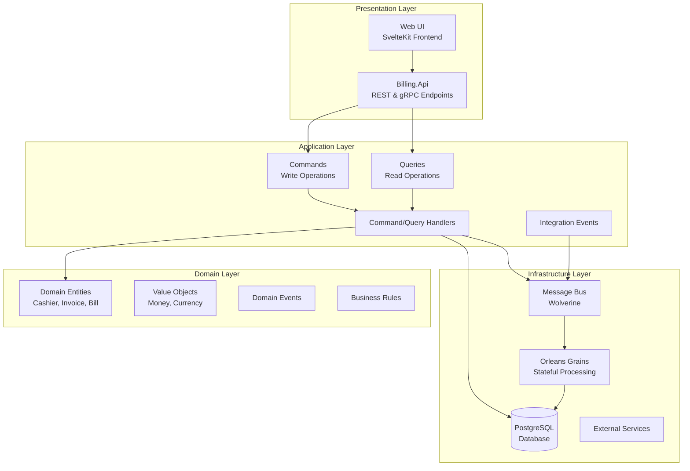

# Architecture Overview

The Billing Solution follows Vertical Slice Architecture principles with CQRS patterns to ensure maintainability, testability, and scalability. This architecture separates concerns into distinct layers while maintaining clear dependency flows.

## Architecture Layers



## Core Principles

### 1. Dependency Inversion

-   **Domain Layer** has no dependencies on infrastructure
-   **Application Layer** depends only on domain abstractions
-   **Infrastructure Layer** implements interfaces defined in application layer
-   **Presentation Layer** orchestrates application services

### 2. Single Responsibility

-   Each layer has a clear, focused responsibility
-   Domain logic is isolated from infrastructure concerns
-   Business rules are separated from application workflows

### 3. Testability

-   Dependencies are injected through interfaces
-   Domain logic can be unit tested without infrastructure
-   Integration tests verify complete workflows

## Domain Layer

Location: [`src/Billing/`](https://github.com/yourusername/billing/tree/main/src/Billing)

### Entities

Core business objects that represent real-world concepts:

```csharp
// Cashier entity with business identity
public record Cashier
{
    public required Guid TenantId { get; init; }
    public required Ulid CashierId { get; init; }
    public required string Name { get; init; }
    public required string Email { get; init; }
    public List<CashierPayment> CashierPayments { get; init; } = [];
}
```

### Value Objects

Immutable objects that describe aspects of the domain:

```csharp
public record Money(decimal Amount, Currency Currency);
public record Currency(string Code, string Symbol);
```

### Domain Events

Events that represent business state changes:

```csharp
public record CashierCreated(Ulid CashierId, string Name, string Email);
public record InvoicePaid(Ulid InvoiceId, DateTime PaidAt, decimal Amount);
```

## Application Layer

Location: [`src/Billing/*/Commands/`](https://github.com/yourusername/billing/tree/main/src/Billing) and [`src/Billing/*/Queries/`](https://github.com/yourusername/billing/tree/main/src/Billing)

### CQRS Implementation

**Commands** (Write Operations):

-   Create, Update, Delete operations
-   Business workflow orchestration
-   Event publishing

**Queries** (Read Operations):

-   Data retrieval with filtering
-   Pagination support
-   Optimized for read performance

### Command Example

```csharp
[DbCommand(sp: "billing.invoices_create")]
public record CreateInvoiceCommand : IRequest<Result<Invoice>>
{
    public required string Name { get; init; }
    public required decimal Amount { get; init; }
    public required string Currency { get; init; }
    public required DateOnly DueDate { get; init; }
    public required Ulid CashierId { get; init; }
}
```

### Source Generation

The `[DbCommand]` attribute enables compile-time code generation:

```csharp
// Generated handler code
public partial class CreateInvoiceCommandHandler : IRequestHandler<CreateInvoiceCommand, Result<Invoice>>
{
    public async Task<Result<Invoice>> Handle(CreateInvoiceCommand request, CancellationToken cancellationToken)
    {
        // Generated database call
        var invoice = await ExecuteStoredProcedure(request);

        // Generated event publishing
        await PublishEvent(new InvoiceCreated(invoice.InvoiceId, invoice.Name, invoice.Amount));

        return Result.Success(invoice);
    }
}
```

## Infrastructure Layer

### Database Integration

**PostgreSQL with Dapper**:

-   Connection management through `IDbConnection`
-   Stored procedure execution with parameter mapping
-   Transaction support for consistency

**Liquibase Migrations**:

-   Version-controlled schema changes
-   Database setup automation
-   Multi-environment support

### Message Bus

**Wolverine Integration**:

-   Event publishing and subscription
-   Message routing and transformation
-   Retry policies and dead letter queues

### Orleans Grains

**Stateful Processing**:

-   Invoice state management
-   Long-running workflows
-   Distributed actor model

## Presentation Layer

Location: [`src/Billing.Api/`](https://github.com/yourusername/billing/tree/main/src/Billing.Api)

### REST API

**ASP.NET Core Controllers**:

-   HTTP endpoint definitions
-   Request/response mapping
-   Authentication and authorization

**OpenAPI Documentation**:

-   Swagger/Scalar UI integration
-   Request/response schemas
-   API versioning support

### gRPC Services

**Protocol Buffers**:

-   Type-safe service definitions
-   High-performance communication
-   Streaming support

## Cross-Cutting Concerns

### Error Handling

The `Result<T>` pattern provides explicit error handling:

```csharp
public class Result<T>
{
    public bool IsSuccess { get; private init; }
    public T Value { get; private init; }
    public string Error { get; private init; }

    public static Result<T> Success(T value) => new() { IsSuccess = true, Value = value };
    public static Result<T> Failure(string error) => new() { IsSuccess = false, Error = error };
}
```

### Logging

**Serilog Configuration**:

-   Structured logging with correlation IDs
-   Context enrichment for requests
-   Multiple sinks (Console, File, Database)

### Validation

**FluentValidation**:

-   Command validation before processing
-   Business rule enforcement
-   Clear error messages

## Testing Strategy

### Unit Tests

**Domain Testing**:

-   Business logic validation
-   Entity behavior verification
-   Value object immutability

**Command/Query Testing**:

-   Handler logic validation
-   Mock infrastructure dependencies
-   Result pattern verification

### Integration Tests

**Full Stack Testing**:

-   Database integration with TestContainers
-   Event publishing verification
-   API endpoint testing

### Architecture Tests

**NetArchTest Rules**:

-   Dependency direction enforcement
-   Layer isolation verification
-   Naming convention validation

## Benefits

### Maintainability

-   Clear separation of concerns
-   Reduced coupling between layers
-   Easy to modify and extend

### Testability

-   Isolated business logic
-   Mockable dependencies
-   Fast unit test execution

### Scalability

-   Horizontal scaling with Orleans
-   Database read/write separation
-   Event-driven asynchronous processing

### Developer Experience

-   Clear code organization
-   Consistent patterns
-   Generated boilerplate code

## Next Steps

-   Explore [Event-Driven Architecture](/arch/events)
-   Learn about [Database Design](/arch/database)
-   Review [Testing Strategies](/arch/testing)
-   Understand [Background Processing](/arch/background-processing)
