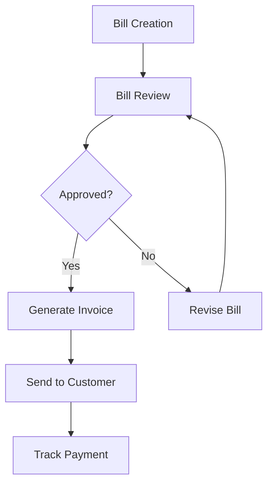

# Bills Guide

The Bills domain will provide comprehensive bill management functionality for the Billing Solution.

## Coming Soon

The Bills module is currently under development and will include:

### Core Features

-   **Bill Creation and Management**: Create and track bills with multiple line items
-   **Recurring Billing**: Support for subscription-based and recurring bill generation
-   **Bill Templates**: Reusable templates for common billing scenarios
-   **Bulk Operations**: Process multiple bills simultaneously

### Integration Points

-   **Invoice Generation**: Automatic invoice creation from approved bills
-   **Payment Scheduling**: Integration with payment processing systems
-   **Customer Portal**: Self-service bill viewing and payment options
-   **Reporting**: Comprehensive billing analytics and reports

### Planned Capabilities

### Architecture Preview

The Bills domain will follow the same architecture patterns as Cashiers and Invoices:

-   **Commands**: CreateBill, UpdateBill, ApproveBill, GenerateRecurringBills
-   **Queries**: GetBill, ListBills, GetBillingSummary
-   **Events**: BillCreated, BillApproved, BillCancelled, RecurringBillGenerated
-   **Models**: Bill, BillLineItem, BillingSchedule, BillTemplate

## Stay Tuned

Check back soon for the complete Bills documentation. In the meantime:

-   Explore [Cashiers Management](/guide/cashiers/)
-   Learn about [Invoice Processing](/guide/invoices/)
-   Review the [Architecture Overview](/arch/)

## Contributing

Interested in helping build the Bills module? Check out:

-   [Development Setup](/guide/dev-setup)
-   [First Contribution Guide](/guide/first-contribution)
-   [Architecture Patterns](/arch/)
