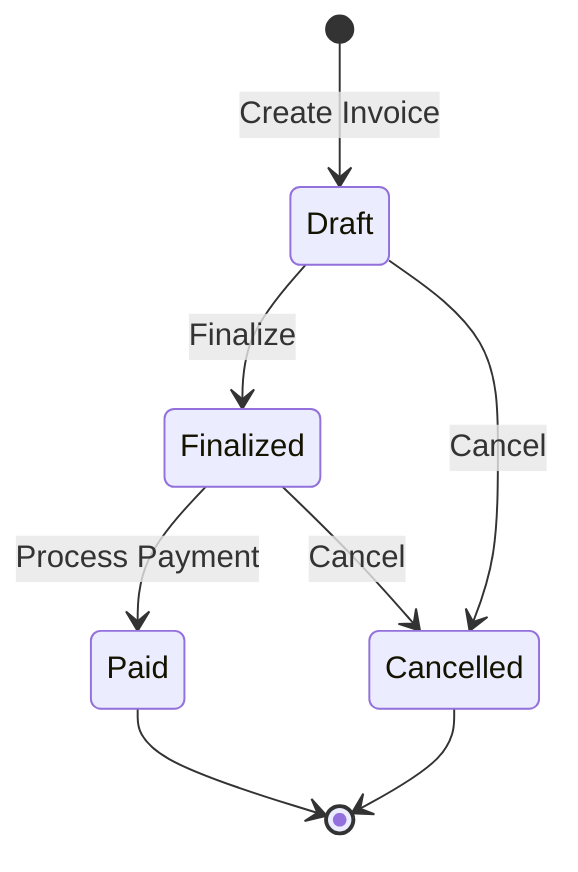
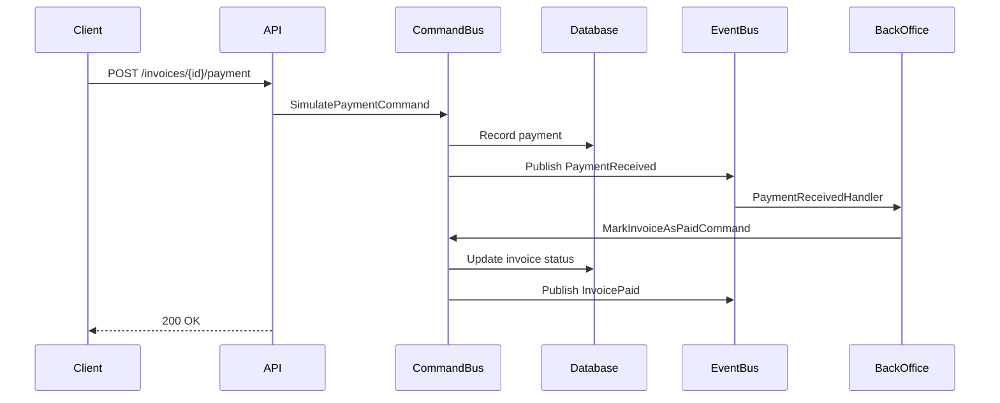
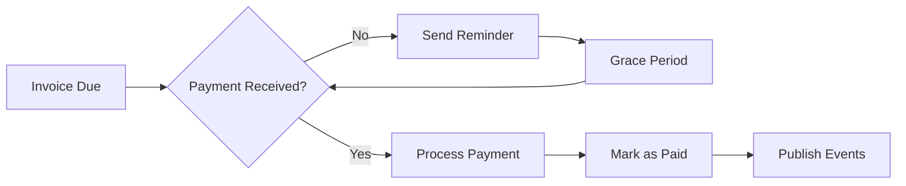

# Invoices Guide

The Invoices domain handles the complete invoice lifecycle from creation through payment. This guide covers invoice management, status transitions, and payment workflows.

## Overview

Invoices are the core financial documents in the billing system that:

-   Track amounts owed by customers
-   Manage payment terms and due dates
-   Support multiple status workflows
-   Integrate with cashier payment processing
-   Publish events for downstream systems

## Domain Model

The Invoice entity is defined in [`src/Billing/Invoices/Contracts/Models/Invoice.cs:5-26`](https://github.com/yourusername/billing/blob/main/src/Billing/Invoices/Contracts/Models/Invoice.cs#L5-L26):

<<< @/../src/Billing/Invoices/Contracts/Models/Invoice.cs

## Invoice Status Lifecycle

Invoices follow a defined status progression:



### Status Definitions

-   **Draft**: Initial state, invoice can be modified
-   **Finalized**: Locked for payment, no modifications allowed
-   **Paid**: Payment received and processed
-   **Cancelled**: Invoice voided, no payment expected

## API Operations

### Create Invoice

**Endpoint**: `POST /api/invoices`

Creates a new invoice in Draft status.

```bash
curl -X POST http://localhost:8101/api/invoices \
  -H "Content-Type: application/json" \
  -d '{
    "name": "Q1 2025 Services",
    "amount": 5000.00,
    "currency": "USD",
    "dueDate": "2025-08-30",
    "cashierId": "csh_123456"
  }'
```

**Command**: [`src/Billing/Invoices/Commands/CreateInvoice.cs`](https://github.com/yourusername/billing/blob/main/src/Billing/Invoices/Commands/CreateInvoice.cs)

### Get Invoice

**Endpoint**: `GET /api/invoices/{invoiceId}`

Retrieves invoice details including current status.

```bash
curl http://localhost:8101/api/invoices/inv_789012
```

**Query**: [`src/Billing/Invoices/Queries/GetInvoice.cs`](https://github.com/yourusername/billing/blob/main/src/Billing/Invoices/Queries/GetInvoice.cs)

### List Invoices

**Endpoint**: `GET /api/invoices`

Returns paginated invoice list with filtering options.

```bash
curl "http://localhost:8101/api/invoices?status=Finalized&page=1&pageSize=50"
```

**Query**: [`src/Billing/Invoices/Queries/GetInvoices.cs`](https://github.com/yourusername/billing/blob/main/src/Billing/Invoices/Queries/GetInvoices.cs)

### Cancel Invoice

**Endpoint**: `POST /api/invoices/{invoiceId}/cancel`

Cancels an invoice (allowed from Draft or Finalized status).

```bash
curl -X POST http://localhost:8101/api/invoices/inv_789012/cancel
```

**Command**: [`src/Billing/Invoices/Commands/CancelInvoice.cs`](https://github.com/yourusername/billing/blob/main/src/Billing/Invoices/Commands/CancelInvoice.cs)

### Process Payment

**Endpoint**: `POST /api/invoices/{invoiceId}/payment`

Simulates payment receipt for testing.

```bash
curl -X POST http://localhost:8101/api/invoices/inv_789012/payment \
  -H "Content-Type: application/json" \
  -d '{
    "amount": 5000.00,
    "paymentDate": "2025-07-17"
  }'
```

**Command**: [`src/Billing/Invoices/Commands/SimulatePayment.cs`](https://github.com/yourusername/billing/blob/main/src/Billing/Invoices/Commands/SimulatePayment.cs)

## Payment Processing Workflow

The payment workflow demonstrates the event-driven architecture:



### Payment Handler

The [`PaymentReceivedHandler`](https://github.com/yourusername/billing/blob/main/src/Billing.BackOffice/Messaging/Invoices/PaymentReceivedHandler.cs) processes payments asynchronously:

<<< @/../src/Billing.BackOffice/Messaging/BillingInboxHandler/PaymentReceivedHandler.cs{11-18}

## Integration Events

### InvoiceCreated

Published when a new invoice is created.

<<< @/../src/Billing/Invoices/Contracts/IntegrationEvents/InvoiceCreated.cs

### InvoicePaid

Published when an invoice is marked as paid.

<<< @/../src/Billing/Invoices/Contracts/IntegrationEvents/InvoicePaid.cs

### InvoiceCancelled

Published when an invoice is cancelled.

<<< @/../src/Billing/Invoices/Contracts/IntegrationEvents/InvoiceCancelled.cs

### PaymentReceived

Published to trigger payment processing.

<<< @/../src/Billing/Invoices/Contracts/IntegrationEvents/PaymentReceived.cs

## Database Schema

Invoice data is stored in PostgreSQL:

**Table**: [`billing.invoices`](https://github.com/yourusername/billing/blob/main/infra/Billing.Database/Liquibase/billing/tables/invoices.sql)

**Key Stored Procedures**:

-   `billing.invoices_create` - Create new invoice
-   `billing.invoices_cancel` - Cancel invoice
-   `billing.invoices_mark_as_paid` - Update to paid status
-   `billing.invoices_get` - Retrieve single invoice
-   `billing.invoices_list` - List invoices with filters

## Testing Patterns

### Unit Tests

Location: [`tests/Billing.Tests/Unit/Invoices/`](https://github.com/yourusername/billing/tree/main/tests/Billing.Tests/Unit/Invoices)

Example from [`CreateInvoiceCommandHandlerTests.cs:14-59`](https://github.com/yourusername/billing/blob/main/tests/Billing.Tests/Unit/Invoices/CreateInvoiceCommandHandlerTests.cs#L14-L59):

<<< @/../tests/Billing.Tests/Unit/Invoices/CreateInvoiceCommandHandlerTests.cs{24-44}

### Integration Tests

Integration tests verify the complete flow including event publishing and database operations.

## Common Scenarios

### Standard Invoice Flow

1. Create invoice in Draft status
2. Review and finalize invoice
3. Send to customer
4. Receive payment notification
5. Process payment via event handler
6. Invoice marked as Paid
7. Notification events published

### Late Payment Handling



### Refund Processing

While not yet implemented, the architecture supports refund workflows through:

-   Negative payment amounts
-   Status transitions (Paid → Refunded)
-   Refund event publishing

## Best Practices

1. **Validation**: Always validate amounts are positive and due dates are future
2. **Currency Handling**: Use ISO 4217 currency codes (USD, EUR, etc.)
3. **Idempotency**: Payment processing should be idempotent
4. **Event Ordering**: Consider event ordering for financial consistency
5. **Audit Trail**: All status changes should be logged

## Error Handling

The system uses the `Result<T>` pattern for explicit error handling:

<<< @/../src/Billing/Invoices/Commands/CreateInvoice.cs{29-45}

## Troubleshooting

### Common Issues

**Payment Not Processing**

-   Check event bus connectivity
-   Verify BackOffice service is running
-   Review event handler logs

**Invalid Status Transition**

-   Ensure invoice is in correct status
-   Check business rule validation
-   Review status transition diagram

**Duplicate Payments**

-   Implement idempotency keys
-   Check for existing payments
-   Use database constraints

## Next Steps

-   Explore [Cashier Management](/guide/cashiers/)
-   Learn about [Event-Driven Architecture](/arch/events)
-   Review [Database Design](/arch/database)
-   Understand [Testing Strategies](/arch/testing)
